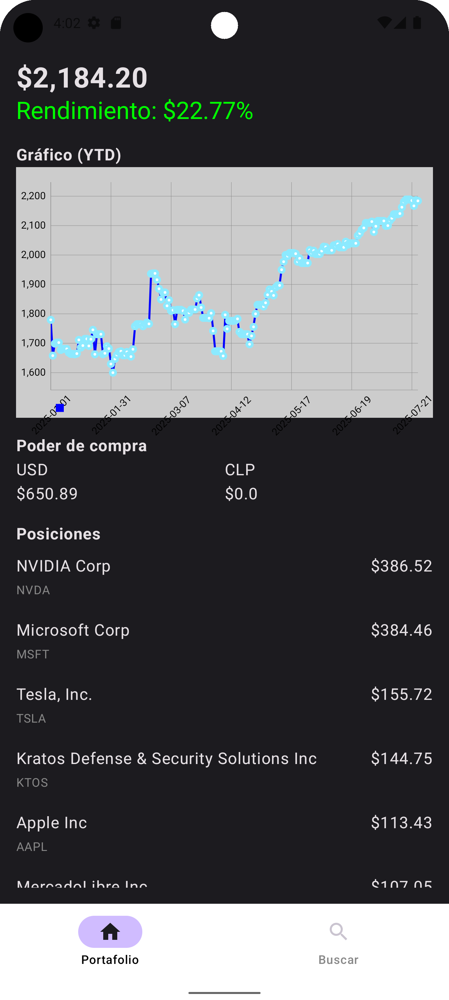
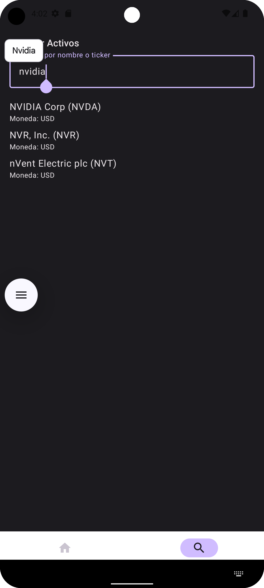

## __Abacus APP__

### __ABOUT__

### App que visualiza desempeño de un portafolio

## __FEATURES__

* Ver el portafolio del usuario en pantalla principal
* buscar activos por filtrando por nombre
* estructurado por capas para data y lógica de negocio
* pantallas diseñadas con Jetpack Compose
* MVVM para visualizar interfaz de usuario y datos
* retrofit y coroutines para cargar datos
* navigation para navegación entre pantallas

## __COMPILE__
### minSdk 26,targetSdk 34, JavaVersion.VERSION_17, gradle-8.6-bin

### Portfolio

### Search
